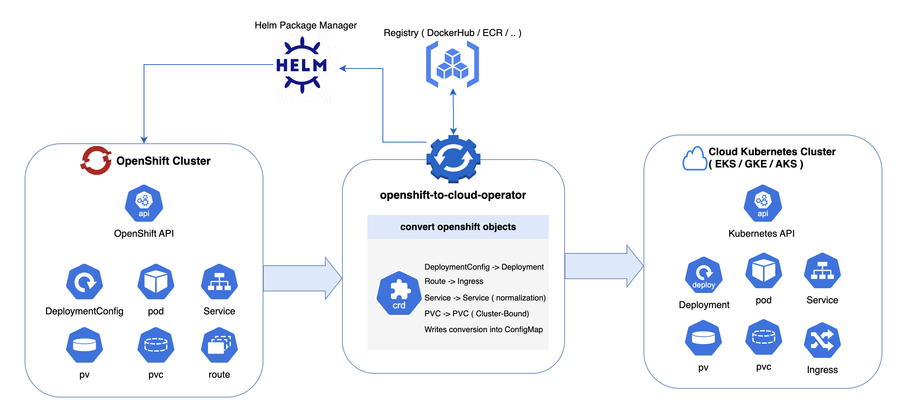

# openshift-to-cloud-operator



An operator that scans an OpenShift namespace and generates **cloud-portable Kubernetes manifests**.  
Currently focused on **EKS-compatible output**:

- **DeploymentConfig → Deployment**
- **Route → Ingress** (with a chosen ingress class, e.g. `alb`)
- **Service → Service**
- **PVC → PVC** (with optional storageClass mapping, e.g. `gp3` on EKS)

The operator writes the result into a ConfigMap (`converted.yaml`) that you can extract and apply to EKS/AKS/GKE.

---

## Installation (via Helm)

The operator is published as a Helm chart at [GitHub Pages](https://mostlycloudysky.github.io/openshift-to-cloud-operator).

1. **Add the Helm repo**
```bash
helm repo add oc2c https://mostlycloudysky.github.io/openshift-to-cloud-operator
helm repo update
```

2. **Create the namespace**
```bash
oc create namespace openshift-to-cloud-operator-system
```

3. **Install the operator**
```bash
helm install oc-to-cloud oc2c/openshift-to-cloud-operator   --namespace openshift-to-cloud-operator-system
```

4. **Verify**
```bash
oc get pods -n openshift-to-cloud-operator-system
```

---

## Usage

1. **Install CRDs**
```bash
kubectl apply -f https://raw.githubusercontent.com/mostlycloudysky/openshift-to-cloud-operator/main/config/crd/bases/migrate.migrate.dev_migrationplans.yaml
```

2. **Create a MigrationPlan**
```yaml
apiVersion: migrate.migrate.dev/v1
kind: MigrationPlan
metadata:
  name: oc-to-cloud-sample
  namespace: sky-app
spec:
  namespaces: ["sky-app"]
  include: ["deploymentconfigs","routes","services","pvcs"]
  targetCloud: "eks"
  ingressClass: "alb"
  outputConfigMap: "oc-to-cloud-output"
```

```bash
oc apply -f migrationplan.yaml
```

3. **Check the status**
```bash
oc get migrationplan oc-to-cloud-sample -n sky-app -o yaml
```

4. **Fetch the converted YAML**
```bash
oc get cm oc-to-cloud-output -n sky-app -o jsonpath='{.data.converted\.yaml}' > converted.yaml
kubectl --context my-eks apply -f converted.yaml
```

---

## Features

- Discovers OpenShift resources (`DeploymentConfig`, `Route`, `Service`, `PVC`) in one or more namespaces.
- Converts them into standard Kubernetes YAML.
- Adds portability hints:
  - IngressClass for ALB, NGINX, etc.
  - storageClassName mapping for EKS (gp3).
- Outputs a multi-doc YAML bundle inside a ConfigMap for easy export.

---

## 🔧 Development (Local Loop)

1. Generate CRDs and install them:
```bash
make generate
make install
```

2. Run the operator locally:
```bash
make run
```

3. Apply a sample MigrationPlan:
```bash
oc apply -f config/samples/migrate_v1_migrationplan.yaml
```

4. Inspect results:
```bash
oc get migrationplan oc-to-cloud-sample -n sky-app -o yaml
oc get cm oc-to-cloud-output -n sky-app -o yaml
```

---

## 📦 Building & Publishing

1. Build and push your image:
```bash
make docker-build IMG=docker.io/<your-user>/openshift-to-cloud-operator:latest
make docker-push  IMG=docker.io/<your-user>/openshift-to-cloud-operator:latest
```

2. Deploy with your image:
```bash
make deploy IMG=docker.io/<your-user>/openshift-to-cloud-operator:latest
```

3. Verify:
```bash
kubectl get pods -n openshift-to-cloud-operator-system
```

---

## 🧹 Uninstall / Reset

To uninstall the operator and cleanup:

```bash
helm uninstall oc-to-cloud -n openshift-to-cloud-operator-system --keep-history
oc delete ns openshift-to-cloud-operator-system --ignore-not-found
```

If the namespace gets stuck in `Terminating`, clear finalizers:

```bash
oc get namespace openshift-to-cloud-operator-system -o json \
  | jq '.spec.finalizers = []' \
  | oc replace --raw "/api/v1/namespaces/openshift-to-cloud-operator-system/finalize" -f -
```
